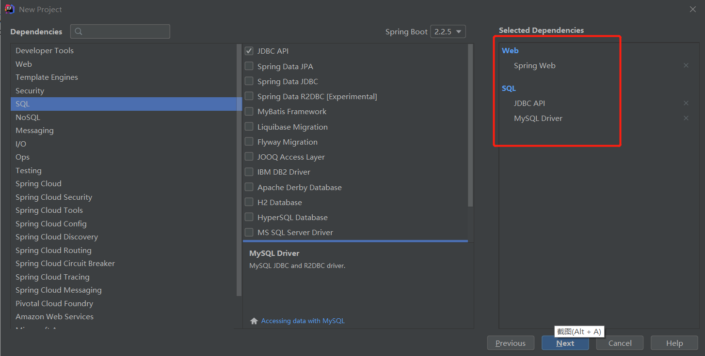

#【SpringBoot】数据持久化——JdbcTemplate

> **如果饿了就吃，困了就睡，渴了就喝，人生就太无趣了**   
> **作者：可耳**   
> **更新时间 ： 2020年03月04日**  
> **博客地址：[https://blog.csdn.net/weixin_41938180/article/details/104656117](https://blog.csdn.net/weixin_41938180/article/details/104656117)**

--- 
## 1 项目配置
### 1.1 添加依赖
在创建`SpringBoot`项目时，添加基本的`Web`依赖，`jdbc`依赖和数据库驱动依赖。如图1：



项目创建完成后修改一下`pom.xml`,主要是修改`mysql`的依赖
```
	<dependencies>
        <dependency>
            <groupId>org.springframework.boot</groupId>
            <artifactId>spring-boot-starter-jdbc</artifactId>
        </dependency>
        <dependency>
            <groupId>org.springframework.boot</groupId>
            <artifactId>spring-boot-starter-web</artifactId>
        </dependency>

        <dependency>
            <groupId>mysql</groupId>
            <artifactId>mysql-connector-java</artifactId>
            <version>8.0.11</version>
        </dependency>
        <dependency>
            <groupId>org.springframework.boot</groupId>
            <artifactId>spring-boot-starter-test</artifactId>
            <scope>test</scope>
            <exclusions>
                <exclusion>
                    <groupId>org.junit.vintage</groupId>
                    <artifactId>junit-vintage-engine</artifactId>
                </exclusion>
            </exclusions>
        </dependency>
    </dependencies>
```

### 1.2 配置`application.properties`文件
在`application.properties`文件添加如下内容：
- url是mysql的ip地址，端口号如果没有改动过默认是3306，斜杆后面是数据库名称
- username是登录mysql的用户名
- password是登录密码

```
spring.datasource.url=jdbc:mysql://127.0.0.1:3306/mydb?useSSL=false&serverTimezone=GMT%2B8
spring.datasource.username=root
spring.datasource.password=123456
spring.datasource.driver-class-name=com.mysql.cj.jdbc.Driver

```
## 2 使用JdbcTemplate（部分代码，全部代码github中）
在数据库中创建`user`表，如图2：

创建`User`对象类
```
public class User {
    private String name;
    private String password;

    public User() {
    }

    public String getName() {
        return name;
    }

    public String getPassword() {
        return password;
    }

    public void setName(String name) {
        this.name = name;
    }

    public void setPassWord(String password) {
        this.password = password;
    }

    @Override
    public String toString() {
        return "User{" +
                "name='" + name + '\'' +
                ", passWord='" + password + '\'' +
                '}';
    }
}

```

### 2.1 例子类图
如图3：
- 流程就是请求被`UserController`接收，之后调用`UserService`的方法，进行数据处理，最后调用`UserDao`对数据进行增删改查
- `addUser()`增加在数据库增加用户信息
- `removeUser()`删除某个用户信息
- `updateUserPassword()`更新用户密码
- `selectUserInfo()`查询全部用户信息


下面只介绍`UserDao`中使用`JdbcTemplate`用法,
`JdbcTemplate`的用法和传统的JDBC用法很相似，只不过将连接配置等工作交给spring来做了。
### 2.2 增(insert) addUser
`insert` 语句调用`JdbcTemplate`API就可以了，传入`sql`语句即可，返回`int`，表示修改库表行数
```
	/**
     * 在user表中插入新的用户信息
     *
     * @param user
     * @return
     */
    public boolean insertUser(User user) {
        int i = jdbcTemplate.update("insert into user(name,password) values(?,?)", user.getName(), user.getPassword());
        if (i == 1) {
            return true;
        } else {
            return false;
        }
    }
```

### 2.3 删(delete) deleteUser()
`delete` 语句同样是调用`JdbcTemplate`API就可以了，和`insert`的用法相同

```
	/**
     * 删除user表中name= username 的记录
     *
     * @param userName
     * @return
     */
    public boolean deleteUser(String userName) {
        int i = jdbcTemplate.update("delete from user where name=?", userName);
        if (i == 1) {
            return true;
        } else {
            return false;
        }
    }
```
### 2.4 改(update) updateUserPassword()
`update`语句也是调用调用`JdbcTemplate.update()`API即可。
```
	/**
     * 更改对应用户的密码
     *
     * @param user
     * @return
     */
    public boolean updateUserPassword(User user) {
        int i = jdbcTemplate.update("update user set password=? where name=?", user.getPassword(), user.getName());
        if (i == 1) {
            return true;
        } else {
            return false;
        }
    }
```

### 2.5 查(select) selectUserInfo()
`select`语句调用的API使用`query()`方法
```
	/**
     * 查询用户表全部信息
     *
     * @return
     */
    public List selectUserInfo() {
        return jdbcTemplate.query("select * from user",
                new RowMapper<User>() {
                    @Override
                    public User mapRow(ResultSet resultSet, int i) throws SQLException {
                        User u = new User();
                        u.setName(resultSet.getString("name"));
                        u.setPassWord(resultSet.getString("password"));
                        return u;
                    }
                });
    }
```


